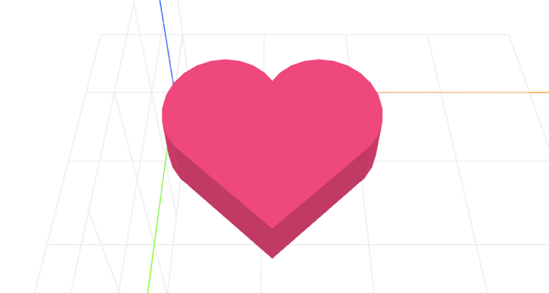

# craft-heart
Parameterized Heart Model

### Usage
```html
<craft>
    <craft name="heart" module="craft-heart"/>
    <heart></heart>
</craft>
```

### Parameters
- height: adjusts height of heart
	- default: 5

### Example
```html
<craft>
    <craft name="heart" module="craft-heart"/>
    <row>
</craft>
```

